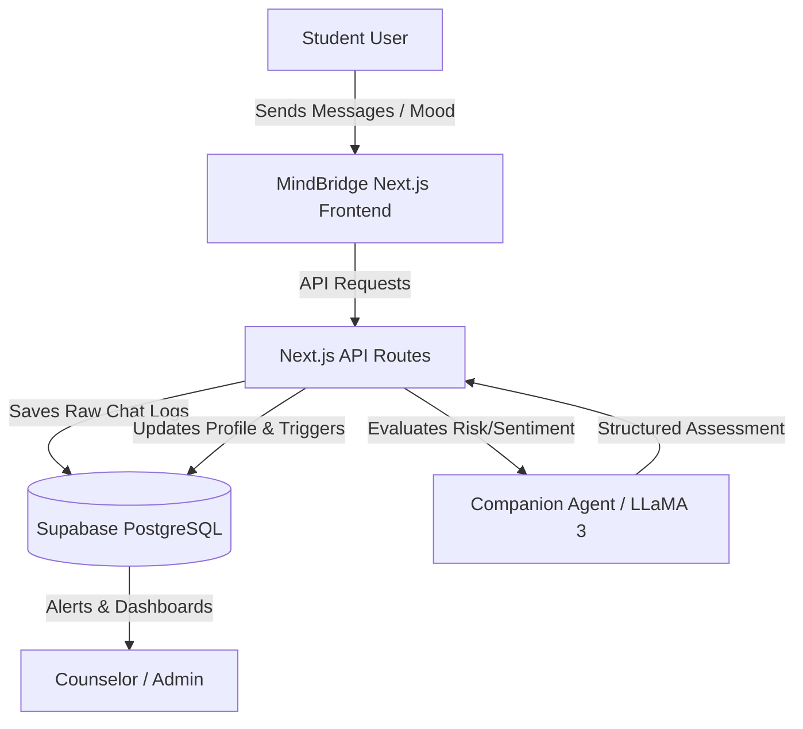
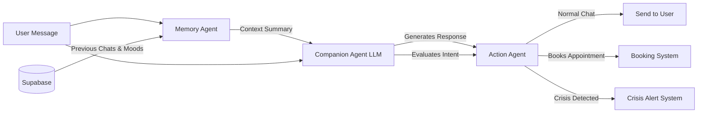
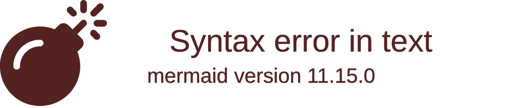
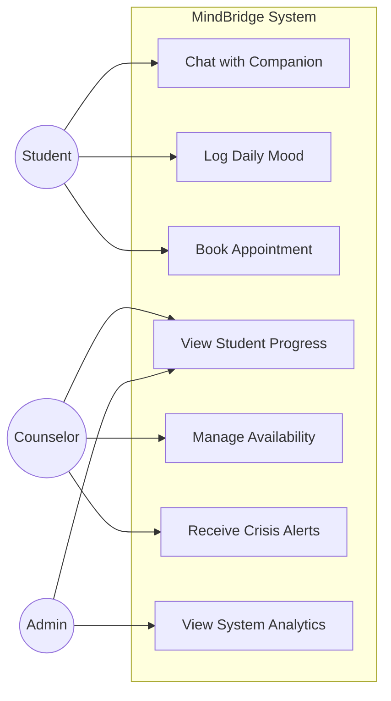
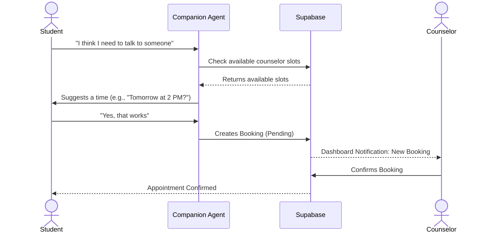
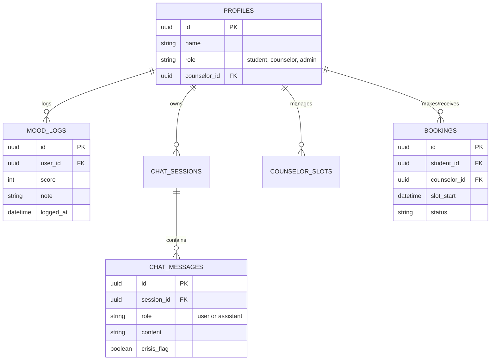

# MindBridge System Architecture & DFDs

Here are the Mermaid diagrams representing the architecture, data flow, and database models used in MindBridge. You can copy these code blocks into [diagrams.net (Draw.io)](https://app.diagrams.net/) or any Mermaid live editor.

## 1. Data Collection (DFD Level 0)
*How we collect data from the student and process it through the system.*

## 2. Chatbot Architecture
*The internal mechanism of the Companion Agent processing a message.*

## 3. Overall Application Architecture
*A high-level view of all the building blocks working together.*

## 4. Use-Case Diagram
*The main actors and what they can do.*

## 5. Appointment Booking & Counselor Flow
*How a student connects with a counselor through the AI.*

## 6. Entity Relationship (ER) Diagram
*Database schema overview (Level 1).*

